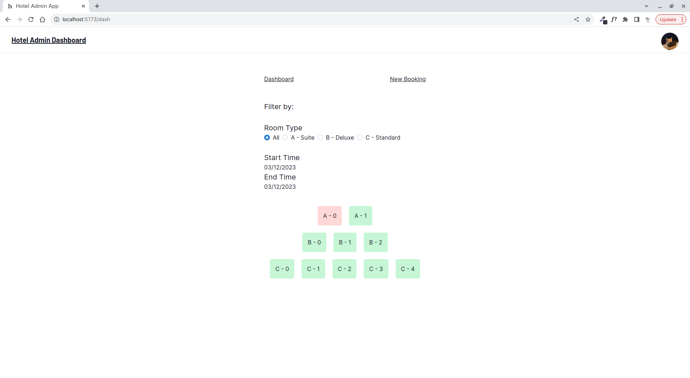
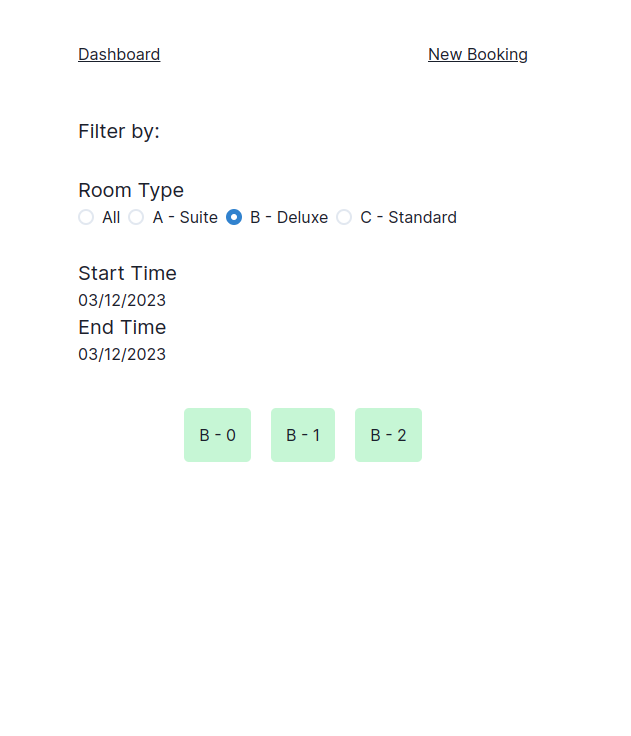
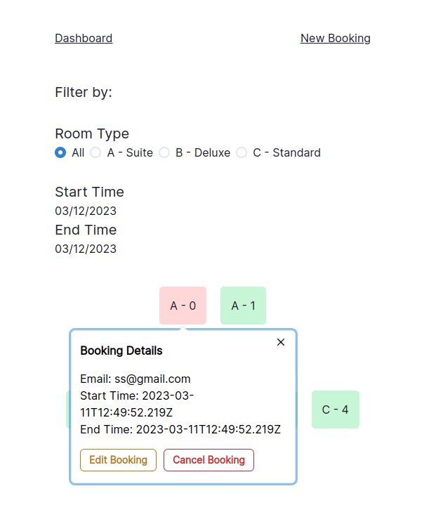
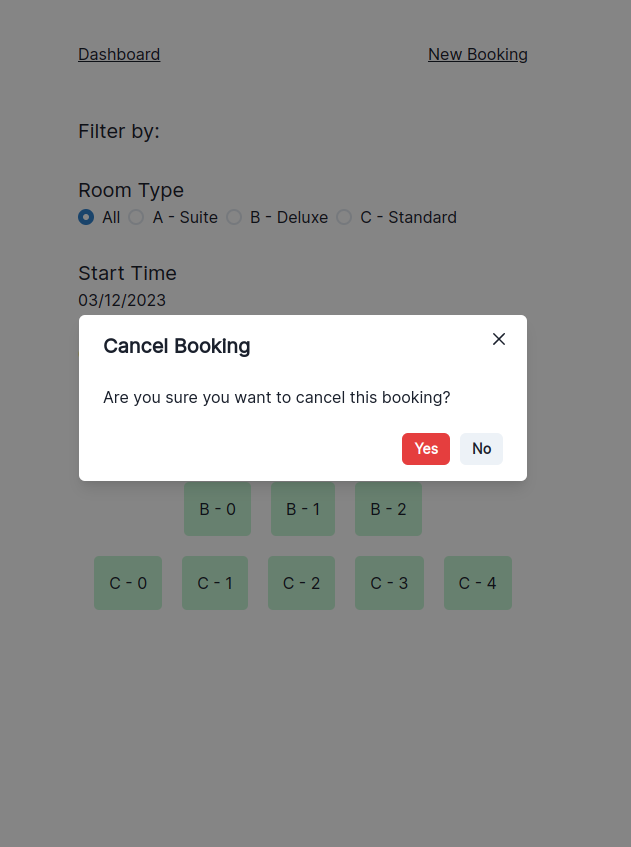
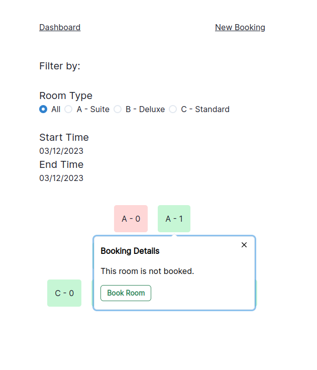
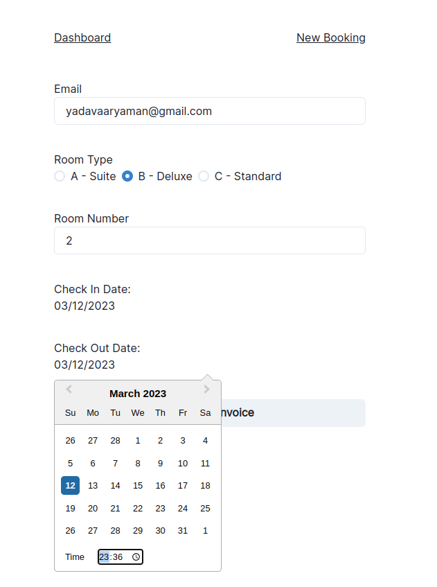
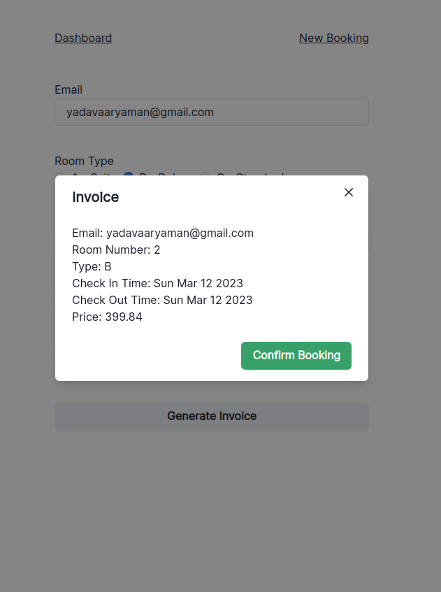

# Hotel Room Management Admin App

**Steps to run the app:**
```bash
git clone https://github.com/aaryadav/hotel_management_admin.git 
cd hotel_management_admin
```

Open two terminals and run `sh run_server.sh` in one `sh run_ui.sh` in the other.

**Screenshots**

Dashboard:



Room Type Filter:



Booked Room Details:



Cancel Booking Confirmation:



Unbooked Room Dropdown:



New Booking Page:



Invoice:


